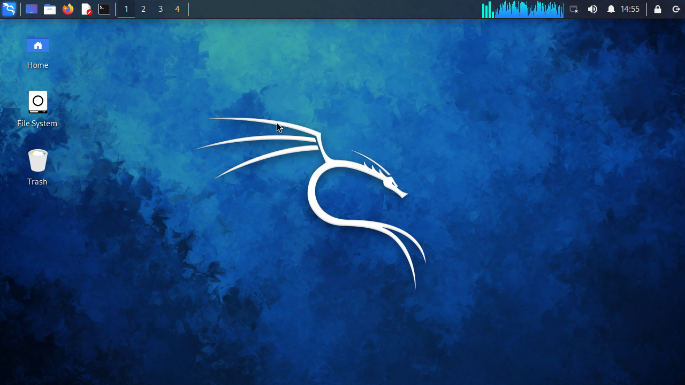

# KaliLinux desktop in termux
# installtion
- `pkg update -y && pkg upgrade -y`
   - `pkg install git wget -y`
   - `git clone https://github.com/aymensec/kali-on-termux.git`
   - `cd kali-on-termux`
   - `bash install-kali.sh`
   - `kali`
   - `bash gui.sh`
   - then select **XFCE**, **LXDE**, **LXQT**, choose Desktop 
